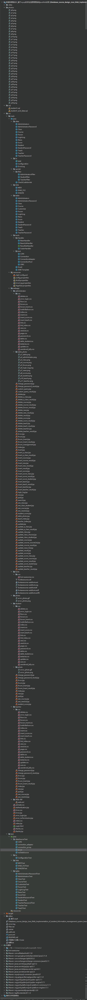

# 本人大三上期的数据库课程设计

## 基于MYSQL的学生信息管理系统javaWeb实现

耗时20天

数据库使用的是MySQL

使用了Druid连接池

前端使用了html、css、javascript（少量）、jsp页面、servlet和servlet过滤器， 页面包含大量的动画效果

后端使用的是java。service层：table包的所有类；dao层：data包的所有类、tools包的所有类。 使用了JDBC模板，大大降低了代码重复。所有的sql语句都不是拼接的（除了使用LIMIT关键字分页）， 不要想到sql注入。

sql文件在sql文件夹里，sql文件夹里有两个文件，一个是只有表结构的，一个是有表结构和数据的。 绝大部分数据都是程序生成的，生成的类在io包里，Add类，执行添加的代码在text文件夹下（JUnit5）。

## 关于密码：

password表中存放的是密码对应的散列值，学生的是MD5，教师的是SHA256，管理员的是SHA3_512。 初始密码是身份证后六位，如果不是，那就是我改了，更改后的密码是111111， 我只更改了校长和部分学生的密码。

## 关于代码：

代码总共33403行。文件数量：241，字符总数：920648，有效字符总数：669192，空格数：218053。

其中：

.java文件：71个，10616行；

.jsp文件：100个，14096行；

.html文件：1个，470行；

.css文件：69个，8221行

## 关于数据库连接池测试：

说明：使用不同的连接池测试1000次查询和10000次查询的时间消耗。

测试对象：druid连接池、C3P0连接池、自定义连接池适配器设计模式、 自定义连接池动态代理方式、不使用数据库连接池。

测试的sql语句：select * from administrators where administrator_no=10001。

数据库：MYSQL。

### 测试结果：

### Druid：

* 1000次查询：480毫秒
* 10000次查询：2337毫秒

### C3P0:

* 1000次查询：748毫秒
* 10000次查询：2854毫秒

### 自定义连接池适配器设计模式：

* 1000次查询：662毫秒
* 10000次查询：3441毫秒

### 自定义连接池动态代理模式：

* 1000次查询：632毫秒
* 10000次查询：3608毫秒

### 不使用数据库连接池：

* 1000次查询：12198.45毫秒（只测试了一次）
* 10000次查询：115499.75毫秒（只测试了一次）

### 总结：

* 对于MYSQL，Druid连接池查询性能最好，因为Druid连接池对MySQL进行了特别优化，其它3个数据库连接池性能差不多。
* 不使用数据库连接池比使用数据库连接池查询性能慢了30倍左右，所以，不管什么场合，尽量使用数据库连接池。
* 此测试有很大的局限性。真正的环境比测试环境还要复杂，并且是并发查询的。

### 测试示例代码（以Druid为例）：

```java
public class druid
{
    /**
     * 查询方法，此方法用于将一条记录封装成一个自定义对象并返回，如果resultSetHandler中参数传人的是Student.class,
     * 则返回的是一个Student类的对象
     *
     * @param sql              sql查询语句，建议通过主键查找，如果查询的sql语句有多条记录，则返回第一条记录
     *                         sql语句实例：select * from table where primaryKey=?
     * @param resultSetHandler ResultSetHandler<T>对象，使用：new BeanHandler<>(自定义对象.class)
     * @param objs             sql中的问号占位符，数量和顺序一定要一致
     * @param <T>              泛型，自定义对象
     * @return 返回自定义对象
     */
    public static <T> T queryForObject(String sql, ResultSetHandler<T> resultSetHandler, Object... objs)
    {
        //定义泛型变量
        T object = null;
        //连接对象
        Connection connection = null;
        //预编译执行者对象
        PreparedStatement preparedStatement = null;
        //结果集对象
        ResultSet resultSet = null;
        try
        {
            //获取连接对象(Druid连接池)
            connection = Druid.getConnection();
            //C3P0连接池
            //connection=tools.test.C3P0.getConnection();
            //或者(自定义数据库连接池)：
            //connection = connectionPool.getConnection();
            //或者直接获取(自定义JDBC工具类)：
            //connection = JDBC.getConnection();

            //预编译sql，返回执行者对象
            preparedStatement = connection.prepareStatement(sql);
            //获取参数的源信息对象
            ParameterMetaData parameterMetaData = preparedStatement.getParameterMetaData();
            //获取参数个数
            int count = parameterMetaData.getParameterCount();
            //判断参数是否一致，如果不一致，异常抛出
            if (objs.length != count)
            {
                throw new RuntimeException("queryForObject方法中参数个数不一致!");
            }
            //为问号占位符赋值
            for (int i = 0; i < count; i++)
            {
                preparedStatement.setObject(i + 1, objs[i]);
            }
            //执行sql语句,返回结果集
            resultSet = preparedStatement.executeQuery();
            //通过beanHandler类中的handler方法对结果集进行处理
            object = resultSetHandler.handler(resultSet);
        }
        catch (Exception e)
        {
            e.printStackTrace();
//            final Writer writer = new StringWriter();
//            final PrintWriter printWriter = new PrintWriter(writer);
//            e.printStackTrace(printWriter);
//            String stackTraceStr = writer.toString();
//            ErrorLog.write(stackTraceStr);
        }
        finally
        {
            //释放资源
            Druid.close(connection, preparedStatement, resultSet);
            //或者：
            //JDBC.close(connection, preparedStatement);
        }
        //返回结果
        return object;
    }

    /**
     * 测试用的查询方法
     * @return data.Administrators对象
     */
    public static data.Administrators select()
    {
        //sql语句
        String sql = "select * from administrators where administrator_no=10001";
        //查询
        Administrators administrator = queryForObject(sql, new BeanHandler<>(Administrators.class));
        //返回
        if (administrator.getAdministrator_idcard() == null)
        {
            return null;
        }
        return administrator;
    }

    @Test
    void start()
    {

        //查询一次，启动，加载
        Administrators result = select();
        if (result == null)
        {
            throw new RuntimeException("异常");
        }
        //开始计时
        //------------------------------------------------------
        long startTime = System.nanoTime();   //获取开始时间
        //------------------------------------------------------
        for (int i = 0; i < 10000; i++)
        {
            select();
        }
        //------------------------------------------------------
        long endTime = System.nanoTime(); //获取结束时间
        if ((endTime - startTime) < 1000000)
        {
            double final_runtime;
            final_runtime = (endTime - startTime);
            final_runtime = final_runtime / 1000;
            System.out.println("算法运行时间： " + final_runtime + "微秒");
        }
        else if ((endTime - startTime) >= 1000000 && (endTime - startTime) < 10000000000L)
        {
            double final_runtime;
            final_runtime = (endTime - startTime) / 1000;
            final_runtime = final_runtime / 1000;
            System.out.println("算法运行时间： " + final_runtime + "毫秒");
        }
        else
        {
            double final_runtime;
            final_runtime = (endTime - startTime) / 10000;
            final_runtime = final_runtime / 100000;
            System.out.println("算法运行时间： " + final_runtime + "秒");
        }
        Runtime r = Runtime.getRuntime();
        float memory;
        memory = r.totalMemory();
        memory = memory / 1024 / 1024;
        System.out.printf("JVM总内存：%.3fMB\n", memory);
        memory = r.freeMemory();
        memory = memory / 1024 / 1024;
        System.out.printf(" 空闲内存：%.3fMB\n", memory);
        memory = r.totalMemory() - r.freeMemory();
        memory = memory / 1024 / 1024;
        System.out.printf("已使用的内存：%.4fMB\n", memory);
        //------------------------------------------------------
    }
}
```

<br>
<br>
<br>
<br>
<br>
大三，水平不高，做不出什么很好的项目，就只能是这个水平了，
绝大部分东西都是自学的，跟学校没关系，前端完全自学，还没学完，
等大四了学到更多东西后我会做更好的项目。

# 项目结构



### 效果展示：

### 视频

[](video/演示.mp4)

或者

<video src="video/演示.mp4" controls="controls">您的浏览器不支持播放该视频！</video>

### 图片


## sql表结构

```sql
/*
 Navicat MySQL Data Transfer

 Source Server         : localhost_3306
 Source Server Type    : MySQL
 Source Server Version : 80027
 Source Host           : localhost:3306
 Source Schema         : student1

 Target Server Type    : MySQL
 Target Server Version : 80027
 File Encoding         : 65001

 Date: 15/02/2022 15:26:33
*/

SET NAMES utf8mb4;
SET
FOREIGN_KEY_CHECKS = 0;

-- ----------------------------
-- Table structure for administrators
-- ----------------------------
DROP TABLE IF EXISTS `administrators`;
CREATE TABLE `administrators`
(
    `administrator_no`               bigint                                                 NOT NULL COMMENT '管理员编号',
    `administrator_name`             varchar(20) CHARACTER SET utf8 COLLATE utf8_general_ci NOT NULL COMMENT '管理员姓名',
    `administrator_sex`              varchar(4) CHARACTER SET utf8 COLLATE utf8_general_ci  NOT NULL COMMENT '管理员性别',
    `administrator_telephone_number` varchar(20) CHARACTER SET utf8 COLLATE utf8_general_ci NULL DEFAULT NULL COMMENT '管理员手机号码',
    `administrator_job`              varchar(20) CHARACTER SET utf8 COLLATE utf8_general_ci NULL DEFAULT NULL COMMENT '管理员职务',
    `administrator_idcard`           varchar(20) CHARACTER SET utf8 COLLATE utf8_general_ci NOT NULL COMMENT '管理员身份证号码',
    PRIMARY KEY (`administrator_no`) USING BTREE
) ENGINE = InnoDB CHARACTER SET = utf8 COLLATE = utf8_general_ci ROW_FORMAT = Dynamic;

-- ----------------------------
-- Table structure for administrators_password
-- ----------------------------
DROP TABLE IF EXISTS `administrators_password`;
CREATE TABLE `administrators_password`
(
    `administrator_no`       bigint                                                  NOT NULL COMMENT '管理员编号',
    `administrator_password` varchar(130) CHARACTER SET utf8 COLLATE utf8_general_ci NOT NULL COMMENT '管理员密码，散列值',
    INDEX                    `administrator_no`(`administrator_no`) USING BTREE,
    CONSTRAINT `administrator_no` FOREIGN KEY (`administrator_no`) REFERENCES `administrators` (`administrator_no`) ON DELETE RESTRICT ON UPDATE RESTRICT
) ENGINE = InnoDB CHARACTER SET = utf8 COLLATE = utf8_general_ci ROW_FORMAT = Dynamic;

-- ----------------------------
-- Table structure for class
-- ----------------------------
DROP TABLE IF EXISTS `class`;
CREATE TABLE `class`
(
    `class_no`              bigint                                                 NOT NULL COMMENT '班级编号',
    `class_name`            varchar(60) CHARACTER SET utf8 COLLATE utf8_general_ci NOT NULL COMMENT '班级名称',
    `class_college`         varchar(30) CHARACTER SET utf8 COLLATE utf8_general_ci NOT NULL COMMENT '所在学院',
    `class_major`           varchar(30) CHARACTER SET utf8 COLLATE utf8_general_ci NOT NULL COMMENT '所属专业',
    `class_enrollment_year` int                                                    NOT NULL COMMENT '入学年份',
    PRIMARY KEY (`class_no`) USING BTREE,
    UNIQUE INDEX `class_no`(`class_no`) USING BTREE
) ENGINE = InnoDB CHARACTER SET = utf8 COLLATE = utf8_general_ci ROW_FORMAT = Dynamic;

-- ----------------------------
-- Table structure for course
-- ----------------------------
DROP TABLE IF EXISTS `course`;
CREATE TABLE `course`
(
    `course_no`     bigint                                                 NOT NULL COMMENT '课程编号',
    `course_name`   varchar(40) CHARACTER SET utf8 COLLATE utf8_general_ci NOT NULL COMMENT '课程名称',
    `course_credit` float                                                  NOT NULL COMMENT '课程学分',
    `course_hour`   int                                                    NOT NULL COMMENT '课程学时',
    `course_mode`   varchar(4) CHARACTER SET utf8 COLLATE utf8_general_ci  NOT NULL COMMENT '方式，考试或者考查',
    PRIMARY KEY (`course_no`) USING BTREE
) ENGINE = InnoDB CHARACTER SET = utf8 COLLATE = utf8_general_ci ROW_FORMAT = Dynamic;

-- ----------------------------
-- Table structure for forum
-- ----------------------------
DROP TABLE IF EXISTS `forum`;
CREATE TABLE `forum`
(
    `forum_no`        bigint                                                 NOT NULL AUTO_INCREMENT COMMENT '论坛编号，楼层',
    `forum_people_no` bigint                                                 NOT NULL COMMENT '论坛发布者的学号或职工号，当发布不当言论时，可以通过此消息定位到某个人，不对外显示，和其它表独立',
    `forum_name`      varchar(12) CHARACTER SET utf8 COLLATE utf8_general_ci NOT NULL COMMENT '论坛发布者姓名',
    `forum_identity`  varchar(10) CHARACTER SET utf8 COLLATE utf8_general_ci NULL DEFAULT NULL COMMENT '论坛发布者身份，学生，老师或者管理员',
    `forum_time`      varchar(30) CHARACTER SET utf8 COLLATE utf8_general_ci NULL DEFAULT NULL COMMENT '论坛发布时间，varchar类型，这里用程序填充时间',
    `forum_content`   varchar(255) CHARACTER SET utf8 COLLATE utf8_general_ci NULL DEFAULT NULL COMMENT '论坛文字内容，最大长度255字',
    PRIMARY KEY (`forum_no`) USING BTREE,
    UNIQUE INDEX `forum`(`forum_no`) USING BTREE COMMENT '唯一索引'
) ENGINE = InnoDB AUTO_INCREMENT = 1 CHARACTER SET = utf8 COLLATE = utf8_general_ci COMMENT = '此表应该独立，当学生被删除时，学生发表的论坛内容应该保存在论坛里' ROW_FORMAT = Dynamic;

-- ----------------------------
-- Table structure for login_log
-- ----------------------------
DROP TABLE IF EXISTS `login_log`;
CREATE TABLE `login_log`
(
    `log_no`       bigint NOT NULL AUTO_INCREMENT COMMENT '登录日志编号',
    `log_time`     varchar(40) CHARACTER SET utf8 COLLATE utf8_general_ci NULL DEFAULT NULL COMMENT '登录时间',
    `log_login_no` bigint NULL DEFAULT NULL COMMENT '登录人的学号或者编号',
    `log_name`     varchar(15) CHARACTER SET utf8 COLLATE utf8_general_ci NULL DEFAULT NULL COMMENT '登录人的姓名',
    PRIMARY KEY (`log_no`) USING BTREE,
    UNIQUE INDEX `log_no`(`log_no`) USING BTREE COMMENT '索引'
) ENGINE = InnoDB AUTO_INCREMENT = 51 CHARACTER SET = utf8 COLLATE = utf8_general_ci COMMENT = '此表为登录日志表，此表应该独立存在，不设外键' ROW_FORMAT = Dynamic;

-- ----------------------------
-- Table structure for news
-- ----------------------------
DROP TABLE IF EXISTS `news`;
CREATE TABLE `news`
(
    `new_no`       bigint NOT NULL AUTO_INCREMENT COMMENT '新闻编号',
    `new_author`   varchar(20) CHARACTER SET utf8 COLLATE utf8_general_ci NULL DEFAULT NULL COMMENT '新闻发布者(作者)',
    `new_identity` varchar(255) CHARACTER SET utf8 COLLATE utf8_general_ci NULL DEFAULT NULL COMMENT '新闻发布者身份',
    `new_time`     varchar(30) CHARACTER SET utf8 COLLATE utf8_general_ci NULL DEFAULT NULL COMMENT '新闻发布时间,这里使用varchar型，时间由程序填充',
    `new_title`    varchar(255) CHARACTER SET utf8 COLLATE utf8_general_ci NULL DEFAULT NULL COMMENT '新闻标题',
    `new_text`     text CHARACTER SET utf8 COLLATE utf8_general_ci NULL COMMENT '新闻内容',
    PRIMARY KEY (`new_no`) USING BTREE
) ENGINE = InnoDB AUTO_INCREMENT = 21 CHARACTER SET = utf8 COLLATE = utf8_general_ci COMMENT = '此表应该独立' ROW_FORMAT = Dynamic;

-- ----------------------------
-- Table structure for score
-- ----------------------------
DROP TABLE IF EXISTS `score`;
CREATE TABLE `score`
(
    `no`          bigint NOT NULL COMMENT '学生学号',
    `course_no`   bigint NOT NULL COMMENT '课程编号',
    `usual_score` float NULL DEFAULT NULL COMMENT '平时成绩',
    `end_score`   float NULL DEFAULT NULL COMMENT '期末成绩',
    `final_score` float NULL DEFAULT NULL COMMENT '最终分数',
    `grade_point` float NULL DEFAULT NULL COMMENT '绩点',
    `semester`    varchar(15) CHARACTER SET utf8 COLLATE utf8_general_ci NULL DEFAULT NULL COMMENT '学期',
    INDEX         `no1`(`no`) USING BTREE,
    INDEX         `course_no`(`course_no`) USING BTREE,
    CONSTRAINT `course_no` FOREIGN KEY (`course_no`) REFERENCES `course` (`course_no`) ON DELETE RESTRICT ON UPDATE RESTRICT,
    CONSTRAINT `no1` FOREIGN KEY (`no`) REFERENCES `student` (`student_no`) ON DELETE RESTRICT ON UPDATE RESTRICT
) ENGINE = InnoDB CHARACTER SET = utf8 COLLATE = utf8_general_ci ROW_FORMAT = Dynamic;

-- ----------------------------
-- Table structure for student
-- ----------------------------
DROP TABLE IF EXISTS `student`;
CREATE TABLE `student`
(
    `student_no`              bigint                                                 NOT NULL COMMENT '学生学号',
    `name`                    varchar(12) CHARACTER SET utf8 COLLATE utf8_general_ci NOT NULL COMMENT '学生姓名',
    `sex`                     varchar(2) CHARACTER SET utf8 COLLATE utf8_general_ci  NOT NULL COMMENT '学生性别',
    `telephone_number`        varchar(15) CHARACTER SET utf8 COLLATE utf8_general_ci NULL DEFAULT NULL COMMENT '电话号码',
    `family_telephone_number` varchar(15) CHARACTER SET utf8 COLLATE utf8_general_ci NULL DEFAULT NULL COMMENT '家庭电话号码',
    `birthday`                varchar(12) CHARACTER SET utf8 COLLATE utf8_general_ci NOT NULL COMMENT '生日信息，由程序填充，这里用varchar型',
    `address`                 varchar(60) CHARACTER SET utf8 COLLATE utf8_general_ci NULL DEFAULT NULL COMMENT '家庭地址',
    `id_card`                 varchar(20) CHARACTER SET utf8 COLLATE utf8_general_ci NOT NULL COMMENT '身份证号码',
    `email`                   varchar(40) CHARACTER SET utf8 COLLATE utf8_general_ci NULL DEFAULT NULL COMMENT '电子邮箱',
    `dormitory_number`        varchar(20) CHARACTER SET utf8 COLLATE utf8_general_ci NULL DEFAULT NULL COMMENT '寝室号',
    `class_no`                bigint                                                 NOT NULL COMMENT '所属班级编号',
    `state`                   varchar(4) CHARACTER SET utf8 COLLATE utf8_general_ci NULL DEFAULT NULL COMMENT '状态，在读、退学或者毕业',
    `remarks`                 varchar(255) CHARACTER SET utf8 COLLATE utf8_general_ci NULL DEFAULT NULL COMMENT '备注',
    PRIMARY KEY (`student_no`) USING BTREE,
    UNIQUE INDEX `no`(`student_no`) USING BTREE,
    INDEX                     `class_no`(`class_no`) USING BTREE,
    CONSTRAINT `class_no` FOREIGN KEY (`class_no`) REFERENCES `class` (`class_no`) ON DELETE RESTRICT ON UPDATE RESTRICT
) ENGINE = InnoDB CHARACTER SET = utf8 COLLATE = utf8_general_ci ROW_FORMAT = Dynamic;

-- ----------------------------
-- Table structure for student_password
-- ----------------------------
DROP TABLE IF EXISTS `student_password`;
CREATE TABLE `student_password`
(
    `no`       bigint                                                 NOT NULL COMMENT '学生学号',
    `password` varchar(34) CHARACTER SET utf8 COLLATE utf8_general_ci NOT NULL COMMENT '学生登录密码，散列值',
    INDEX      `no`(`no`) USING BTREE,
    CONSTRAINT `no` FOREIGN KEY (`no`) REFERENCES `student` (`student_no`) ON DELETE RESTRICT ON UPDATE RESTRICT
) ENGINE = InnoDB CHARACTER SET = utf8 COLLATE = utf8_general_ci ROW_FORMAT = Dynamic;

-- ----------------------------
-- Table structure for teach
-- ----------------------------
DROP TABLE IF EXISTS `teach`;
CREATE TABLE `teach`
(
    `teach_no`   bigint NOT NULL AUTO_INCREMENT COMMENT '编号',
    `teacher_no` bigint NOT NULL COMMENT '老师编号',
    `class_no`   bigint NULL DEFAULT NULL COMMENT '老师所教的班级',
    `course_no`  bigint NULL DEFAULT NULL COMMENT '老师所教的课程',
    `semester`   varchar(15) CHARACTER SET utf8 COLLATE utf8_general_ci NULL DEFAULT NULL COMMENT '学期,比如：2019年下学期',
    PRIMARY KEY (`teach_no`) USING BTREE,
    INDEX        `teacher_no1`(`teacher_no`) USING BTREE,
    INDEX        `class_no1`(`class_no`) USING BTREE,
    INDEX        `course_no1`(`course_no`) USING BTREE,
    CONSTRAINT `class_no1` FOREIGN KEY (`class_no`) REFERENCES `class` (`class_no`) ON DELETE RESTRICT ON UPDATE RESTRICT,
    CONSTRAINT `course_no1` FOREIGN KEY (`course_no`) REFERENCES `course` (`course_no`) ON DELETE RESTRICT ON UPDATE RESTRICT,
    CONSTRAINT `teacher_no1` FOREIGN KEY (`teacher_no`) REFERENCES `teacher` (`teacher_no`) ON DELETE RESTRICT ON UPDATE RESTRICT
) ENGINE = InnoDB AUTO_INCREMENT = 308 CHARACTER SET = utf8 COLLATE = utf8_general_ci ROW_FORMAT = Dynamic;

-- ----------------------------
-- Table structure for teacher
-- ----------------------------
DROP TABLE IF EXISTS `teacher`;
CREATE TABLE `teacher`
(
    `teacher_no`               bigint                                                 NOT NULL COMMENT '老师编号',
    `teacher_name`             varchar(15) CHARACTER SET utf8 COLLATE utf8_general_ci NOT NULL COMMENT '老师姓名',
    `teacher_sex`              varchar(4) CHARACTER SET utf8 COLLATE utf8_general_ci  NOT NULL COMMENT '老师性别',
    `teacher_telephone_number` varchar(15) CHARACTER SET utf8 COLLATE utf8_general_ci NULL DEFAULT NULL COMMENT '老师电话号码',
    `teacher_email`            varchar(40) CHARACTER SET utf8 COLLATE utf8_general_ci NULL DEFAULT NULL COMMENT '老师邮箱',
    `teacher_address`          varchar(60) CHARACTER SET utf8 COLLATE utf8_general_ci NULL DEFAULT NULL COMMENT '老师家庭地址',
    `teacher_idcard`           varchar(20) CHARACTER SET utf8 COLLATE utf8_general_ci NOT NULL COMMENT '老师身份证号码',
    PRIMARY KEY (`teacher_no`) USING BTREE
) ENGINE = InnoDB CHARACTER SET = utf8 COLLATE = utf8_general_ci ROW_FORMAT = Dynamic;

-- ----------------------------
-- Table structure for teacher_password
-- ----------------------------
DROP TABLE IF EXISTS `teacher_password`;
CREATE TABLE `teacher_password`
(
    `teacher_no`       bigint NOT NULL COMMENT '老师编号',
    `teacher_password` varchar(66) CHARACTER SET utf8 COLLATE utf8_general_ci NULL DEFAULT NULL COMMENT '老师登录密码，散列值',
    PRIMARY KEY (`teacher_no`) USING BTREE,
    CONSTRAINT `teacher_no` FOREIGN KEY (`teacher_no`) REFERENCES `teacher` (`teacher_no`) ON DELETE RESTRICT ON UPDATE RESTRICT
) ENGINE = InnoDB CHARACTER SET = utf8 COLLATE = utf8_general_ci ROW_FORMAT = Dynamic;

SET
FOREIGN_KEY_CHECKS = 1;

```